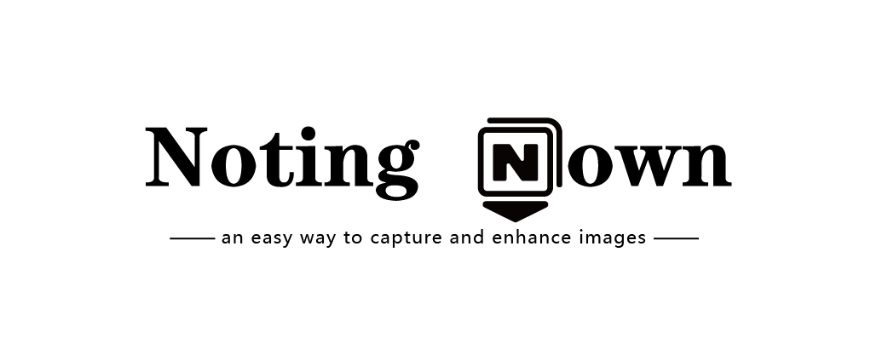

## Introduction

A screenshot and document image reinforcement software, designed to provide **an easy way to capture and enhance images** for note-taking during classes, conferences, and other events. The software includes features like **screen capturing, image binarization(optional color retaining), and perspective correction**.  The software is written in Python using the PyQt5 GUI libraries and is compatible with Windows and Linux operating systems.

## Features

- **Capture screenshot**: users can capture a screenshot of the full screen, a single window or a selected area.
- **Image Processing**: users can apply various image processing techniques such as **screen capturing, image binarization(optional color retaining), and perspective correction**, etc.
- **Hotkeys**: users can use hotkeys to quickly capture a screenshot and start processing the image.

## Installation

### Requirements

It needs Python 3.8 or higher
```
numpy==1.21.5
opencv_python==4.6.0.66
Pillow==9.5.0
PyQt5==5.15.9
system_hotkey==1.0.3
```

### Installation Steps

1. Clone the repository and open it as root directory
```bash
git clone https://github.com/MasterYip/NotingDown.git
cd ./NotingDown
```

2. Install the required packages
```bash
pip install -r requirements.txt
```

3. Run the application
```bash
python main.py
```

## Usage

1. Use the hotkey `Alt+Q` to capture a screenshot of your screen.
2. Use the hotkey `Ctrl+Alt+C` to process the image in your clipboard, the icon in the system tray will indicate the progress.
3. Use the hotkey `Ctrl+Alt+F` to process images in a selected folder.
4. Double-click the icon to adjust settings in the main panel.

## License

This project is licensed under the MIT License - see the LICENSE file for details.

## Contributors

- [Master Yip](https://github.com/MasterYip)
